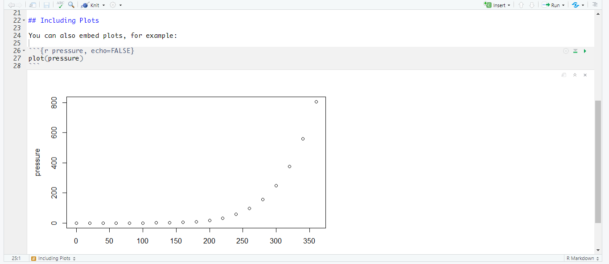
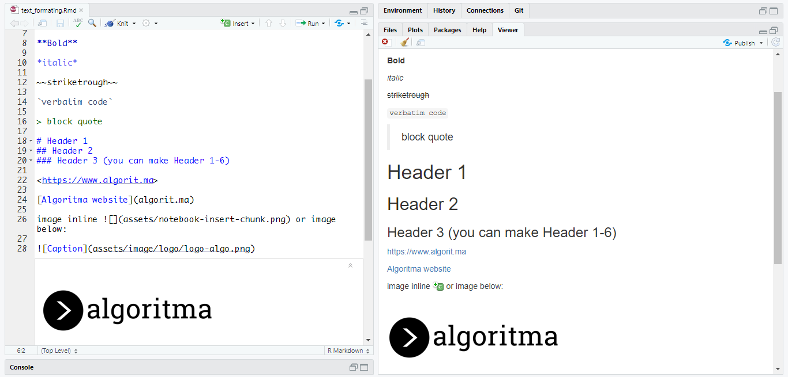
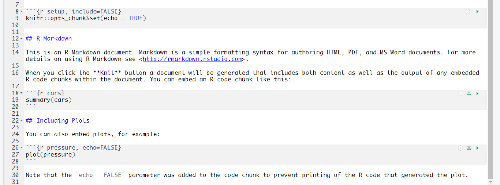
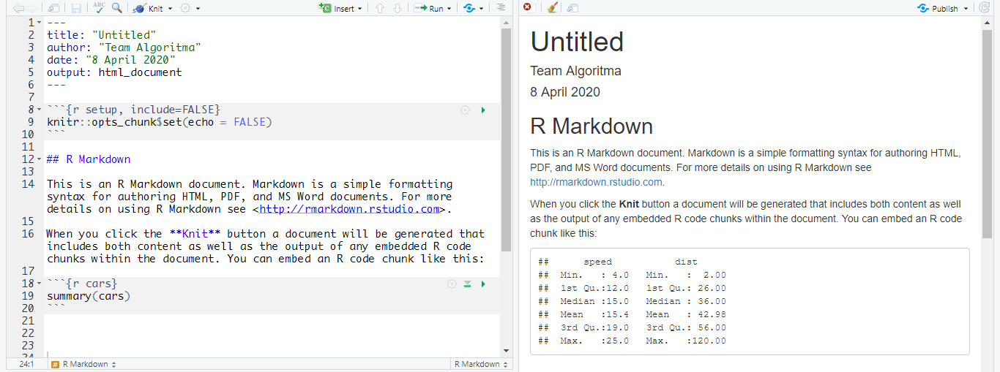
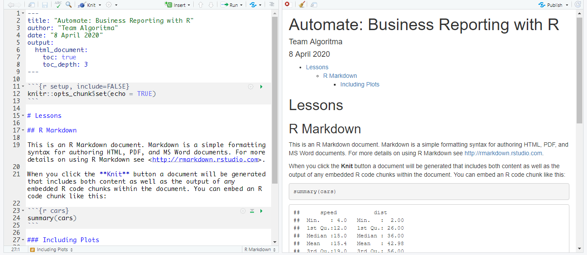
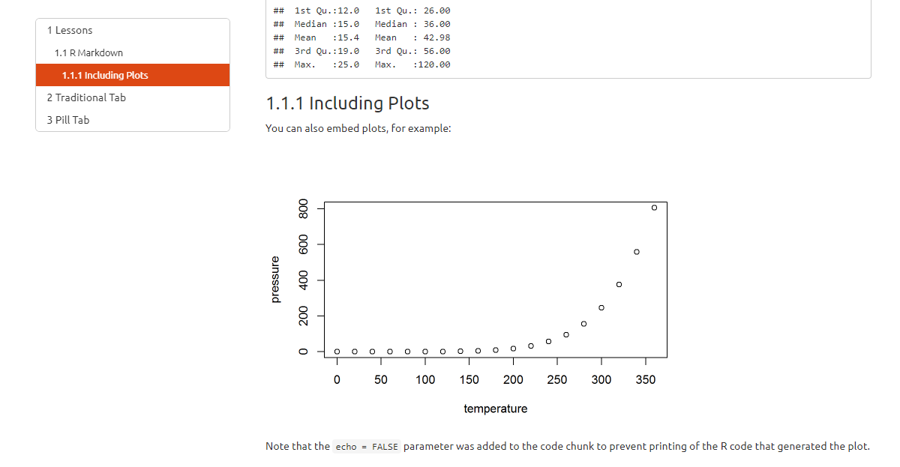
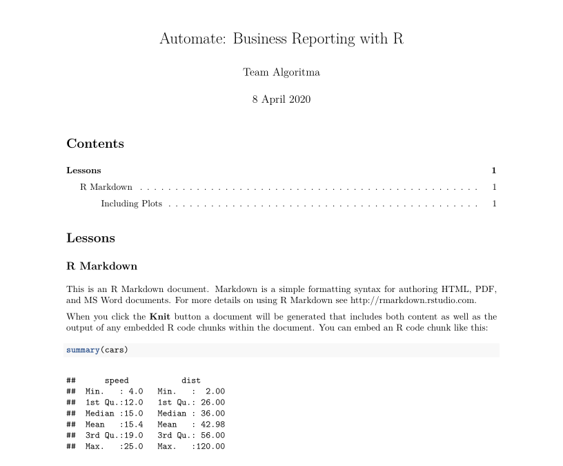
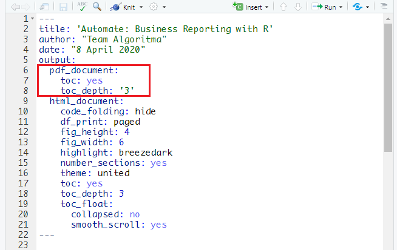
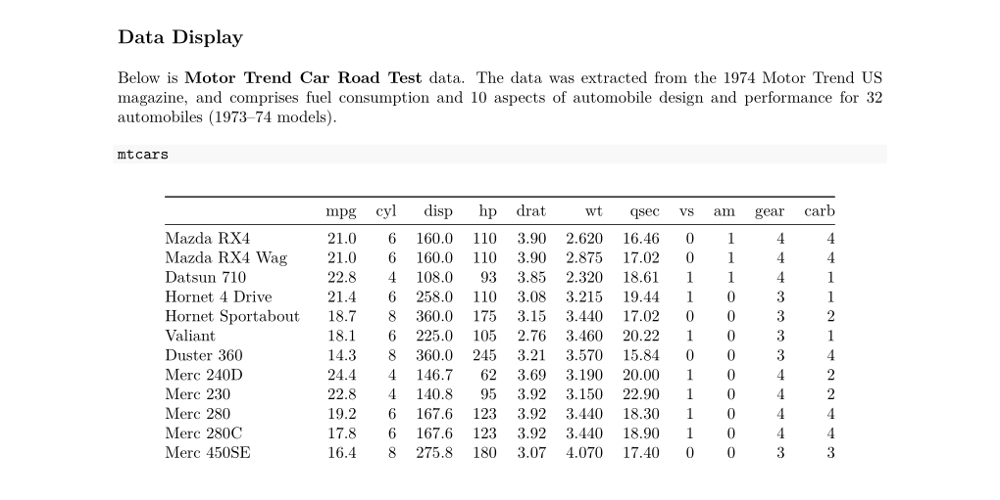

```{r setup, include=FALSE}
# clean up the environment
rm(list = ls())

# setup chunk options
knitr::opts_chunk$set(
  message = FALSE,
  warning = FALSE,
  fig.align = "center",
  comment = "#>"
)

options(scipen = 9999)
```

The following coursebook is produced by the team at **Algoritma** for _Automate: Business Reporting with R_ Online Workshop. The coursebook is intended for a restricted audience only, i.e. the individuals having received this coursebook directly from the training organization. It may not be reproduced, distributed, translated or adapted in any form outside these individuals and organizations without permission.

**Algoritma** is a data science education center based in Jakarta. We organize workshops and training programs to help working professionals and students gain mastery in various data science sub-fields: data visualization, machine learning, data modeling, statistical inference, etc.

Before you go ahead and run the codes in this coursebook, it’s often a good idea to go through some initial setup. Under the **Training Objectives** section we’ll outline the syllabus, identify the key objectives and set up expectations for each module. Under the **Libraries and Setup** section you’ll see some code to initialize our workspace and the libraries we’ll be using for the projects. You may want to make sure that the libraries are installed beforehand by referring back to the packages listed here. 

# Preface {.tabset}

## Introduction

Business reporting has become a common task in many business practices. Business reporting is a regular provision of information about operational or financial data for decision-makers within an organization to support their work. Writing a business report is oftentimes a time-consuming process. It involves the process of gathering data, data analysis, and report preparation which may require us to operate multiple software at once with a very repetitive task. Thus prevent us from focusing on the other more important part of our business.

This 2-day online workshop is a beginner-friendly introduction to automate business reporting with R. By learning how to automate various business reports, you will have more time to focus on what matters the most.

## Training Objectives

This is the very first course of _Automate: Business Reporting with R_. The primary objective of this course is to provide a participant a comprehensive introduction about tools and software for producing a high-quality publication using R and R Markdown. This course will provide participants the basic knowledge for developing Automated Reporting with R. The syllabus covers: 

* **Introduction to R Markdown**
    + R and R Markdown
    + Using R Markdown
    + Writing Codes & Naration
    + Chunk & Global Options
    + Report Template using YAML
    
* **Generate Report from R Markdown**
    + HTML Document
    + PDF Document
    + Word Document
    + Interactive PowerPoint Presentation

* **Parameterized Reports**
    + Declaring parameters
    + Using Parameter in Code Chunks
    + Using Parameter Inline Code

***

## Library and Setup

In this **Library and Setup** section you’ll see some code to initialize our workspace, and the packages we’ll be using for this project. 

_Packages_ are collections of R functions, data, and compiled code in a well-defined format. The directory where packages are stored is called the _library_. R comes with a standard set of packages. Others are available for download and installation. Once installed, they have to be loaded into the session to be used. 

You will need to use `install.packages()` to install any packages that are not yet downloaded onto your machine. To install packages, type the command below on your console then press ENTER.

```{r eval=FALSE}
install.packages("rmarkdown")
```

Then you need to load the package into your workspace using the `library()` function. Special for this course, the _rmarkdown_ packages do not need to be called using `library()`.

```{r eval=FALSE}

```

***

# Introduction to R Markdown

## R and R Markdown

Business reporting involves a series of gathering data from various resources, performing data analysis, producing summary and visualization, and sometimes even provide a future outlook for a specific business practice within an organization. Numerous software was developed to provide such a rich data analytics process. Throughout the years, _R_ has developed into one of the most used tools for data analysis, supported by _RStudio_ as an Integrated Development Environment (IDE) which provide an easy-to-use user interface in working with R. There are reasons why R is widely used for data analysis:

1. **Built by Statisticians, for Statisticians.**

    R is a statistical programming language created by Ross Ihaka and Robert Gentleman at the Department of Statistics, at the University of Auckland (New Zealand). R is created for the purpose of data analysis and as such, is different in nature from traditional programming languages. [R](https://mran.revolutionanalytics.com/rro) is not just a statistical programming language, it is a complete environment for data analyst and the most widely used data analysis software today.

2. **Plentiful Libraries.**

    R provides numerous additional packages for which add out-of-the-box functionalities for various statistical tests (confidence tests, P-value, t-test, etc), time-series analysis, beautiful visualization, and various machine learning tasks such as regression algorithms, classification algorithms, and clustering algorithms. The R community is noted for its active contributions in terms of packages.

3. **Open Source.** 

    Part of the reason for its active and rapidly growing community is the open-source nature of R. Users can contribute packages – many of which packaged some of the most advanced statistical tools and customized templates for visualization that is not found in other commercials, proprietary statistical computing software.

4. **Used by The Biggest Software Companies in The World.**

    Dive deeper into R's analytical capability, R has been used not only for descriptive analytics but also to develop machine learning and artificial intelligence project of major software companies in the world. R is used by Google to calculate ROI on advertising campaigns and estimate causal effect (say, estimate the impact of an app feature on app downloads or number of additional sales from an AdWords campaign); In fact, it even released its own R packages to allow other R users to do similar analysis using the same [tool](https://opensource.googleblog.com/2014/09/causalimpact-new-open-source-package.html). Data Science employees at Google participate in User Groups to discuss how R is used in Google. It’s used very widely in a production environment at Google and Google integrates R with many of their own technologies, publishing [its own R client for the Google Prediction API](https://code.google.com/archive/p/google-prediction-api-r-client/), [Google’s R style guide](http://web.stanford.edu/class/cs109l/unrestricted/resources/google-style.html), and its developers have released a number of R packages over the years. Microsoft first uses R for Azure capacity planning, Xbox’s TrueSkill Matchmaking System, player churn analysis, in-game purchase optimization, fraud detection, and other internal services across Microsoft’s line of [products](https://blog.revolutionanalytics.com/2015/06/r-at-microsoft.html), and then went on to acquire Revolution Analytics, whom products were then rebranded and renewed by Microsoft and now known as Microsoft R Server, Microsoft R Open, Microsoft Data Science Virtual Machine etc.

5. **Ready for Big Data**

    RHadoop, ParallelR, Revolution R Enterprise and a handful of other toolkits adds powerful big data support, allowing data engineers to create custom parallel and distributed algorithms to handle parallel / map-reduce programming in R. This makes R a popular choice for big data analytics and high performance, enterprise-level analytics platform.

In addition to using R we will be using packages named _R Markdown_. R Markdown is R packages made for easy development of dynamic documents for R. R Markdown turn our analysis into high-quality documents, reports, presentations, and dashboards. R Markdown supports the development of various reports and publications using R and open opportunities for **automated reporting**. 

```{r, echo = FALSE, fig.align = "center"}

```

R Markdown supports users with **easy analysis** in R because it enables users to weave together narrative text and code in the document. It supports multiple programming languages including R, Python, and SQL. After performing analysis, R Markdown supports **dozens of static and dynamic output** formats including PDF, Word document, HTML document, and Interactive PowerPoint Presentation. This is made entirely from one R Markdown document, allowing us to **simultaneously export our analysis into various outputs**.

To truly experience the excitement and convenience of using R, our next section will more interesting because we will directly use _R_ and _R Markdown_ to familiarize ourselves with them.

## Using R Markdown

In this first section of R Markdown, we will explain briefly how to use R Markdown, from creating an R Markdown document, its component, and how we can produce a report using R Markdown. 

Before using R Markdown you need to install the package _rmarkdown_ into your machine. To further learn about packages and installation you can see the **Library and Setup** section above. Make sure that you already have the latest version of [_R_](https://cran.r-project.org/) and [_RStudio_](https://rstudio.com/products/rstudio/download/) installed on your machine. If this is your first time using RStudio, you will see this in your RStudio window:

```{r, out.width = "100%", echo = FALSE, fig.align = "center"}
knitr::include_graphics("assets/rstudio.png")
```

<br>

Above is the default view of RStudio. There are 4 panels each with its function:

* **Editor**: is where we can input codes and narration on specific files that can be saved into our computer.
* **Console**: is where we can input codes and perform analysis without saving it into our computer.
* **Environment**: is where R stores our data temporarily when doing data analysis in R. This allows us to see and track our data while doing data analysis. There is also tab **history** and **connection**, though we will not use these in this workshop. 
* **Files, packages, help, etc**: is where we can track our files in our computer, our packages, and search for documentation and description about specific function/command we use in our project. Additionally, there are also **plots** and **viewer** to preview plots and files generated using R.

To easily analyze data and produce business reports using R we will be using R Markdown. We can create new _R Markdown document_ by clicking on the menu **File > New File > R Markdown**. Alternatively, we can hover our mouse to a dropdown menu on the left corner of RStudio  and then choose "R Markdown". We will be directed to a pop-up for creating a new R Markdown document.

```{r, out.width = "80%", echo = FALSE, fig.align = "center"}
knitr::include_graphics("assets/new.png")
```

We can choose the **title** and **author** for our project and there are several output options we can choose. For the introduction, let's use the default HTML output. An R Markdown document, a plain text file with the extension `.Rmd`, will be created on our Editor panel. 

```{r, out.width = "100%", echo = FALSE, fig.align = "center"}
knitr::include_graphics("assets/new2.png")
```

The document contains three types of content:

* **YAML Header** 
    + surrounded by `---` before and after its section. 
    + this is where we can custom our report template (will be discussed in the following section).

* **Code Chunks** 
    + surrounded by ` ``` ` before and after its section, colored gray.
    + this is where we can put R function/commands for data analysis.
    
* **Text/Naration** 
    + space colored white.
    + this is where we write paragraphs or explanations for our business report. 
    + it can be added with various text formatting such as the use of `#` for heading.

This content allow us to write both R command for data analysis and business explanation in one file. That's like working with Excel and Word at the same time, with added functionality to export it into various outputs with a customized template! Such a lot of work can be done with one document. 

In addition to the versatility, another benefit of using R Markdown is its **notebook interface**. With R Markdown, the code inside the chunk can be executed independently and interactively, with **output displayed immediately beneath the chunk**. This allows complex data analysis using R to be performed and previewed easily. For example, if we run the code in the last chunk by clicking the green 'play' icon on the right side, a plot will come out.

```{r, out.width = "100%", echo = FALSE, fig.align = "center"}

```

Finally, we can also export the document into certain or multiple formats by using the _Knit_ button  in RStudio on the upper part of the document.

If we haven't saved our document, R will direct us to save our file. In the example below, the document is saved with the name `dummy.Rmd` inside the same _working directory_ (folder) of our workshop material. The best practice is to store our R Markdown document and the data we use in one working directory. This is to prevent any connection error while importing data and such. After knitting the document, R will produce the document output based on the format we choose earlier.

```{r, out.width = "100%", echo = FALSE, fig.align = "center"}
knitr::include_graphics("assets/new4.png")
```

In the next section, we will explore various ways of writing R codes and narration in R Markdown, including simple text formatting that will produce elegantly formatted output.

## Writing Codes & Naration

### Codes

Writing _codes_ in R Markdown can be done inside a _chunk_. In the demo we made earlier, we have 3 chunks with its respective codes. We can quickly insert a chunk into our document using:

* keyboard shortcut Ctrl + Alt + I (OS X: Cmd + Option + I)
* click the add chunk  button in the Editor toolbar.
* manually type chunk delimiters `` ```{r} `` and `` ``` ``.

When we knit our document, the code output will be displayed beneath the code chunk. Below is an example:

```{r}
print("Hello!")
```

Alternatively, you can also insert code directly into an R Markdown text or we call it as _inline code_  by enclosing the code with `` `r ` ``. For example, `r paste("did you notice that I write this using R codes?")` Because I did, using the following syntax.  

`` For example, `r '\x60r paste("did you notice that I write this using R codes?")\x60'` ``

This facilitates users to include data analysis result into his narration in the business report. R Markdown will display the result of an inline code but not the code, making it indistinguishable from the surrounding text. **This allows flexibility in making an automated business report because we can generate narration adjusting to its changing input and its analysis**.

### Narration

Writing _narration_ in R Markdown is mostly similar to writing narration in any word processing tools. The difference is how R Markdown use [Pandoc's Markdown](https://pandoc.org/MANUAL.html#pandocs-markdown), a set of markup annotations to format the text for our narration.

There are several commonly used annotations in R Markdown. For convenience, we have made a list of it and the preview below. You can access the document `text_formatting.Rmd` in the same folder of course material. These annotations were taken from [_R Markdown Cheatsheet_](https://github.com/rstudio/cheatsheets/raw/master/rmarkdown-2.0.pdf) which you can download freely to explore more about various features in R Markdown.

```{r, out.width = "100%", echo = FALSE, fig.align = "center"}

```

In several cases, you might also want to write a code explanation or _narration inside a chunk_. When you type a narration inside a chunk it will produce an error because R recognizes your narration as a function/command that needs to be executed. To write a narration inside a chunk you will need to mark it as a _comment_ by using `#` before the text. Below is an example: 

```{r}
# this is a nice comment!
# and below is a simple math operation to run:
(4+6)/3
```

## Chunk & Global Options

### Chunk Options

If you noticed earlier, most of the code we made inside the chunk will be displayed and so is the output. This is because we follow a set of default chunk options when generating an R Markdown output. _Chunk options_ is a set of customizable argument to manage how chunks should be rendered when generating outputs. By default, chunks use an argument called `echo = TRUE` which means to **display the code** in the generated output.

```{r, out.width = "100%", echo = FALSE, fig.align = "center"}

```

Above is an example of chunks taken from `dummy.Rmd` that we made earlier. The document contains 3 chunks in which two of them have chunk options that were set. The _chunk options_ can be set inside the bracket `{}` of a chunk header, following after a _chunk name/id_ (chunk name is optional). Below is an example:

`` ```{r pressure, echo = FALSE}``` ``

We can see a chunk named **pressure** followed by comma `,` and chunk option `echo` which set as `FALSE`. Based on the option that was set, R will execute the code, display the output but will not display or *echoing* the code in the R Markdown output.

```{r, out.width = "100%", echo = FALSE, fig.align = "center"}

```

There are several chunk options users commonly use:

* **include** = default to TRUE, if FALSE chunk will not be included in the final document but code will still be executed.
* **eval** = default to TRUE, if FALSE code will not be executed.
* **echo** = default to TRUE, if FALSE code will not be displayed in the final document.
* **message** = default to TRUE, if FALSE the message generated from the code will not be displayed.
* **warning** = default to TRUE, if FALSE the warning generated from the code will not be displayed.
* **fig.height, fig.width** = the figure width & height used for creating a figure/plot output. 

For a complete list of chunk options, you can see the _R Markdown Cheatsheet_ or for a more compressed version in [_R Markdown Reference Guide_](https://rstudio.com/wp-content/uploads/2015/03/rmarkdown-reference.pdf).

### Global Options 

Sometimes, you want to set specific chunk options to all the chunk in a document. We can set these using the _global chunk options_. We can type `knitr::opts_chunk$set` in a code chunk and R will treat each option we pass into it as global chunk options.

The chunk named **setup** from `dummy.Rmd` is an example where we set the `echo = TRUE` for all chunks. If we want to hide all codes within our document then we can just change the echo options into `echo = FALSE`. Below is an example of how we hide the code which made a summary of **cars data**, which previously displayed in the generated output.

```{r, out.width = "100%", echo = FALSE, fig.align = "center"}

```

Note that **global chunk options can be overwritten** by options we set in the individual chunk headers. This is why the generated output did not display code chunk to make the pressure plot even though it stated `echo = TRUE` in the global chunk options. Notice that we have set `echo = FALSE` in the individual chunk. 

## Report Template using YAML

The last part of the R Markdown introduction is to customize our report template using YAML. _YAML_ stated in the first part of any R Markdown document.  A default YAML will contain the following: 

```
title: "title of the document"
author: "author of the document"
date: "date of the document"
output: html_document
```

The default output for an R Markdown is _HTML document_. Which is why HTML document has the richest features among other output formats. We can specify **other outputs** inside YAML output options (which we will cover in the next section), but prior understanding about how YAML in HTML document work will help us a lot in understanding the other outputs. 

Before exploring many features of the HTML document, let's add more content to our `dummy.Rmd`. Use the knowledge you have learned from the previous section to do the following tasks:

1. Change the title of the document to "Automate: Business Reporting with R".
2. Change the author of the document to your name.
3. Change the date of the document into today's date.
4. Add a level 1 Header named "Lessons" before the header "R Markdown".
5. Change "Including Plots" into a level 3 header (thus will be located inside the "R Markdown" section).

### Table of Content

To add various features to our HTML output, we can position `html_document` in a new line with a tab (ENTER + TAB). Indentation is important in YAML and therefore should be checked thoroughly.

The first feature is _table of content_ which you can add using `toc` options below (ENTER + Double TAB). You can specify the depth of headers that applies to the table of content using  `toc_depth` options (defaults to 3). Using the YAML below, the generated output will only display the table of content for level 1-3 headers.

```
title: "Automate: Business Reporting with R"
author: "Team Algoritma"
date: "8 April 2020"
output: 
  html_document:
    toc: true
    toc_depth: 3
```

```{r, out.width = "100%", echo = FALSE, fig.align = "center"}

```

You can also position the table of content on the left side of the document and make it float by using `toc_float`. _Floating table of content_ will always be visible even when the document is scrolled. You can set two additional options into the `toc_float`:

* **collapsed**: default to true, whether toc will display only the top-level header (level 1-2).
* **smooth scroll**: default to true, whether page scrolls are animated when TOC items are navigated to via mouse clicks.

```
title: "Automate: Business Reporting with R"
author: "Team Algoritma"
date: "8 April 2020"
output: 
  html_document:
    toc: true
    toc_depth: 3
    toc_float:
      collapsed: false
      smooth_scroll: true
```

```{r, out.width = "100%", echo = FALSE, fig.align = "center"}

```

### Section Numbering

You can also add _section numbering_ using `number_sections` options.

```
title: "Automate: Business Reporting with R"
author: "Team Algoritma"
date: "8 April 2020"
output: 
  html_document:
    toc: true
    toc_depth: 3
    toc_float:
      collapsed: false
      smooth_scroll: true
    number_sections: true
```

### Tabbed Sections

If you notice, this coursebook has a tabbed section at **Preface**. The _tabbed section_ can be made using `{.tabset}` after the headers. This will cause all sub-headers of the header with the `{.tabset}` attribute to appear within tabs rather than as standalone sections. 

We can also control the appearance of the tab using:

* **.tabset-fade**: causes the tabs to fade in and out when switching between tabs. 
* **.tabset-pills**: causes the visual appearance of the tabs to be “pill” rather than traditional tab

Below is an example:

```{r, out.width = "100%", echo = FALSE, fig.align = "center"}

```

### Appearence and Style

The most enhanced feature in R Markdown is probably the ability to directly specifies _themes_ for the document. You can choose between **default, cerulean, journal, flatly, darkly, readable, spacelab, united, cosmo, lumen, paper, sandstone, simplex,** and **yeti**. You can preview each one in [here](https://www.datadreaming.org/post/r-markdown-theme-gallery/) included some other themes using additional packages such as _prettydoc_ and _rmdformats_. Alternatively, you can also pass `null` for no theme or if you want to use **CSS parameter** of your own.

We can also specify _highlight_ for the syntax highlighting style. Supported styles include **default, tango, pygments, kate, monochrome, espresso, zenburn, haddock, breezedark,** and **textmate**. Pass `null` to prevent any syntax highlighting.

In this example, we will use theme **united** and highlighting style **breezedark**.

```
title: "Automate: Business Reporting with R"
author: "Team Algoritma"
date: "8 April 2020"
output: 
  html_document:
    toc: true
    toc_depth: 3
    toc_float:
      collapsed: false
      smooth_scroll: true
    number_sections: true
    theme: united
    highlight: breezedark
```

```{r, out.width = "100%", echo = FALSE, fig.align = "center"}

```

### Figure Options

We can also set the parameter for all figures in our R Markdown using _figure options_:

* **fig_width** and **fig_height**: to control figure width and height (by default is 7x5).
* **fig_caption**: whether figures will be rendered with captions.

```
title: "Automate: Business Reporting with R"
author: "Team Algoritma"
date: "8 April 2020"
output: 
  html_document:
    toc: true
    toc_depth: 3
    toc_float:
      collapsed: false
      smooth_scroll: true
    number_sections: true
    theme: united
    highlight: breezedark
    fig_width: 6
    fig_height: 4
```

```{r, out.width = "100%", echo = FALSE, fig.align = "center"}

```

We can see that the plot is slightly smaller than the one generated earlier.

### Data Display

Most of the time we will need to print our data in the form of tables in our business report. We can enhance the display of our data via `df_print` option. For example, we can display it in the form of _paged HTML tables_ by setting the `df_print: paged`. This will allow us to navigate through paged rows and columns. 

```
title: "Automate: Business Reporting with R"
author: "Team Algoritma"
date: "8 April 2020"
output: 
  html_document:
    toc: true
    toc_depth: 3
    toc_float:
      collapsed: false
      smooth_scroll: true
    number_sections: true
    theme: united
    highlight: breezedark
    fig_width: 6
    fig_height: 4
    df_print: paged
```

For example, below is **Motor Trend Car Road Test** data. The data was extracted from the 1974 Motor Trend US magazine and comprises fuel consumption and 10 aspects of automobile design and performance for 32 automobiles (1973–74 models).

```{r}
mtcars
```

The `df_print: paged` options can be very convenient for HTML output, but other formats such as `kable` might be more suitable for PDF and Word. We will discuss further about how to make awesome table using _kableExtra_ in the following course.

### Code Folding

Previously we have discussed how to display and not display code chunk using _chunk options_ in global options/individual chunk. In some cases, we might want the code to be available to show but not visible by default. The _code_folding_ option enables us to include R code in an R Markdown output with choices to **hide** or **show** the R code by default. With this users can choose whether to show R code chunks individually or document-wide. For example:

```
title: "Automate: Business Reporting with R"
author: "Team Algoritma"
date: "8 April 2020"
output: 
  html_document:
    toc: true
    toc_depth: 3
    toc_float:
      collapsed: false
      smooth_scroll: true
    number_sections: true
    theme: united
    highlight: breezedark
    fig_width: 6
    fig_height: 4
    df_print: paged
    code_folding: hide
```

```{r, out.width = "100%", echo = FALSE, fig.align = "center"}

```

We have briefly explored YAML options that are commonly used for R Markdown output (default output HTML document is used for demonstration). Even so, there are still many more YAML options that are available to explore listed and described in [_R Markdown: The Definitive Guide_](https://bookdown.org/yihui/rmarkdown/html-document.html), a book by Yihui Xie, J. J. Allaire, and Garrett Grolemund which created using R Markdown itself. Meanwhile, for a daily lookup, you check the full YAML options in [_R Markdown Cheatsheet_](https://github.com/rstudio/cheatsheets/raw/master/rmarkdown-2.0.pdf) or [_R Markdown Reference Guide_](https://rstudio.com/wp-content/uploads/2015/03/rmarkdown-reference.pdf) for a simplified version.

# Generate Report from R Markdown

Often times users need to create business reports in various formats. For example, A person needs his report to be shared with His teammates in the format of _Word Document_, some others asked for more interactivity and convenience for accessing via browsers so they asked for _HTML Document_. He also needs one to be printed using _PDF_ and the one to be presented in front of the board/team members in _Interactive PowerPoint Presentation_. The most unexpected request then came from His boss who wants His report to be published in the form of **Interactive Dashboard**, so that He can easily access and so do His colleagues and the other department. That's a lot of things to do and create! A person might be too focused on polishing just one business report for each requested format than in developing an in-depth analysis of the case/project that He needs to analyze.

This is the part where R Markdown can help! R Markdown offers various outputs by only using one file including _HTML Document_, _PDF_, _Word Document_, and _Interactive PowerPoint Presentation_ which mostly used for business reports (and will be discussed in this section). In addition to those, R Markdown also supports formats including interactive dashboard, websites, books and more other which you can explore [here](https://rmarkdown.rstudio.com/lesson-9.html).

We can specify the desired output by choosing the format in the **pop-up** that appeared when we first create a new R Markdown file. If we click the _Presentation_ tab we will see several formats for presentation. If we click the _Shiny_ tab we can choose between developing interactive documents or presentations. We can also use a built-in or customized template for our document by choosing _From Template_. 

When we choose an output, R Markdown will automatically specify that output in the _output options_ of our _YAML_. For example, the dummy.Rmd we made earlier is taking the `html_document` output. Below is a glimpse of the YAML from the `dummy.Rmd` we made earlier.

```
title: "Automate: Business Reporting with R"
author: "Team Algoritma"
date: "8 April 2020"
output: 
  html_document:
    toc: true
```

When we **Knit** our document, R will automatically create the first specified output stated in our YAML options (in this case an HTML Document). We can also directly create another format by clicking the **dropdown menu of the Knit button**, and choose the available output. For example, if we choose PDF output than this PDF will be generated:

```{r, out.width = "100%", echo = FALSE, fig.align = "center"}

```

When we look back to our YAML options, R automatically added `output: pdf_document` as a result, complete with the default feature options.

```{r, out.width = "100%", echo = FALSE, fig.align = "center"}

```

The YAML in R Markdown allows users to specify **more than one output format** for his R Markdown document. Moreover, users can also **simultaneously customize the appearance for all of their desired output** using only one document. This is quite an advantage because users do not have to spend an excessive amount of time customizing individually for each specific output in each respective software. Why not use such precious time with something that really matters.

We have understood that there are various outputs that an R Markdown can create. Each output and its format can be set inside the YAML of an R Markdown. Further on, we will be discussing the four outputs that we commonly use for making a business report and how to create one using the R Markdown document we have made earlier.

## HTML Document

HTML Document is a default output of an R Markdown document. The `dummy.Rmd` we made earlier is an example of HTML Document output. Besides choosing HTML output in the "create new R Markdown" pop-up. We can also manually set the output in YAML.

```
title: "Automate: Business Reporting with R"
author: "Team Algoritma"
date: "8 April 2020"
output: html_document
```

The above YAML example will result in default HTML document output, without specific themes or features such as the floating table of content. When we want to specify themes and features we can add YAML options like the one we have discussed in the previous section **"Report Template using YAML"**.

```
title: "Automate: Business Reporting with R"
author: "Team Algoritma"
date: "8 April 2020"
output: 
  html_document:
    toc: true
    toc_depth: 3
    toc_float:
      collapsed: false  
      smooth_scroll: true
    number_sections: true
    theme: united
    highlight: breezedark
    fig_width: 6
    fig_height: 4
    df_print: paged
    code_folding: hide
```

## PDF

To create a PDF output, we can create a new R Markdown and choose the output for _PDF_ or manually setting `output: pdf_document` in YAML. Since many of the HTML document features apply to PDF output, it is preferable to just add the output manually in the YAML if we are working on multiple outputs. After that knitting can be done for PDF output. For example,

```
title: "Automate: Business Reporting with R"
author: "Team Algoritma"
date: "8 April 2020"
output: 
  html_document:
    toc: true
    toc_float: true
  pdf_document:
    toc: true
```

Notice that the indentation for `pdf_document` is inline with the other output `html_document`. YAML options for features in each output can be specified manually too. 

### Features

Many of the features available in HTLM document also available in PDF and can be set in YAML. Those are **table of content** and its depth (default to 3), **number sections**, **figure options**, and **syntax highlighting**. Other features such as setting the font, document margin, and specific types of citation can be explored further in [here](https://bookdown.org/yihui/rmarkdown/pdf-document.html#pdf-document).

### Data Display

Displaying data or tables in PDF is particularly different than in HTML. While HTML document can use `df_print: paged`, PDF can not. This is because of the limitation of static output that PDF has. The options available for displaying data in PDF output is **default**, **kable** and **tibble**, whereas kable offers a more tidy look compared to the others. Below is an example of a data displayed using option **kable**. 

```
title: "Automate: Business Reporting with R"
author: "Team Algoritma"
date: "8 April 2020"
output:
  pdf_document:
    toc: yes
    df_print: kable
```

```{r, out.width = "100%", echo = FALSE, fig.align = "center"}

```

## Word

To create a Word document, we can create a new R Markdown and choose the output for _Word_ or manually setting `output: word_document` in YAML. Same as PDF, many of the HTML document features apply to Word output. Therefore, we can just add the output manually in the YAML. For example,

```
title: "Automate: Business Reporting with R"
author: "Team Algoritma"
date: "8 April 2020"
output: 
  html_document:
    toc: true
    toc_float: true
  word_document:
    toc: true
    df_print: kable
```

```{r, out.width = "100%", echo = FALSE, fig.align = "center"}
knitr::include_graphics("assets/word.png")
```

R Markdown also has a notable feature to create **style reference document** or a Word template. Later on, the template can be passed to the `reference_docx` options of the `word_document` in YAML. You can explore more features for Word document [here](https://bookdown.org/yihui/rmarkdown/word-document.html).

## Interactive PowerPoint Presentation

The last format we will discuss is the presentation formats which includes:

* **Beamer Presentation**: PDF presentations with beamer
* **Ioslides Presentation**: HTML presentations with ioslides
* **Slidy Presentation**: HTML presentations with slidy
* **Powerpoint Presentation**: PowerPoint presentation
* **Revealjs Presentation**: HTML presentations with reveal.js (using additional package _revealjs_)

In this section, we will be focusing more on the _Beamer Presentation_. Nevertheless, each format will intuitively divide our content into slides. The following will discuss how a Beamer Presentation works, its features, and how to customize its appearance.

### How It Works

Creating a Beamer Presentation is almost the same as creating a new HTML document. You can create a new R Markdown and choose the output for Beamer Presentation. Alternatively, you can also manually set `output: beamer_presentation` in YAML.

```
title: "Beamer Presentation"
author: "Team Algoritma"
date: "8 April 2020"
output: beamer_presentation
```

The difference with the HTML document is that it will divide your content into several slides according to `#` and `##` (headers) of your document. Alternatively, you can also create a new slide without using header but a horizontal rule `---`. For example, Here is a demo of beamer presentation:

```{r, out.width = "100%", echo = FALSE, fig.align = "center"}

```

With this ability, we can simply create a presentation from the report we made beforehand by adjusting our content into its simplified version. 

### Themes

Beamer presentation also supports themes! You can specify its appearance in YAML using `theme`,` colortheme`, and `fonttheme`, for example:

```
title: "Beamer Presentation"
author: "Team Algoritma"
date: "8 April 2020"
output: 
  beamer_presentation:
    theme: "Ilmenau"
    colortheme: "beaver"
    fonttheme: "structurebold"
```

```{r, out.width = "100%", echo = FALSE, fig.align = "center"}

```

To explore more variety of themes for the beamer presentation you can access the link [here](https://hartwork.org/beamer-theme-matrix/) and [here](http://deic.uab.es/~iblanes/beamer_gallery/).

### Incremental Bullets

If you want to use incremental bullets on your presentation, you can simply use YAML options `incremental: true`. Either way, you can also set incremental bullets for specific slides by adding `>` before the bullets. Below is an example:

**Setting incremental bullets in YAML:**

```
title: "Beamer Presentation"
author: "Team Algoritma"
date: "8 April 2020"
output: 
  beamer_presentation:
    theme: "Ilmenau"
    colortheme: "beaver"
    fonttheme: "structurebold"
    incremental: true
```

**Setting incremental bullets in each slide:**

```
## Slide with Bullets

 - Bullet 1
 - Bullet 2
> - Bullet 3 (with incremental bullet)
```

Beamer presentation also supports several features that available in HTML document such as **table of content**, **figure options**, and **displaying data or tables**. 

There are more to explore for Beamer Presentation and so are various presentation outputs using R Markdown. For example, if you are interested in creating a dynamic presentation, you can explore _Ioslides Presentation_ or the famous _Revealjs Presentation_. For more features, you can explore the [R Markdown Definitive Guide, Chapter 4: Presentations](https://bookdown.org/yihui/rmarkdown/presentations.html).

We have explored various outputs supported by R Markdown which can be used to develop business reports. Even so, there is still so much more to explore. To look for even more outputs generated from R Markdown, you can explore [The R Markdown Gallery](https://rmarkdown.rstudio.com/gallery.html).

```{r, out.width = "100%", echo = FALSE, fig.align = "center"}

```

# Parameterized Reports
    
R Markdown is great at making reports, but to optimize its potential, let's discuss on how R Markdown can make our report **reproducible** by using _Parameterized Report_.

When we use Parameterized Report, R Markdown will include one or more _parameter_ whose _values_ will be set to create the report. This allows us to determine, for example, the dataset to be made into reports. Allowing us to create _Automated Reporting_!

## Declaring Parameters

Parameters are declared using the `params` option within the _YAML_. For example, the file below creates the parameter named **head** and assigns **5** as its default value.

```{r, out.width = "100%", echo = FALSE, fig.align = "center"}

```

## Using Parameter in Code Chunks

Parameters are made available to be used in code chunk by accessing the value using `params$<parameter name>`. For example, the code below can be used to display **the first 5 observations** of the data. This is done by passing 5 (the default value) from `params$head` into the `head()` function which will return the first n-observation of a data. 

```{r eval=F}
USArrests %>% 
  head(params$head)
```

As a side note, `head()` and other R codes used for data analysis will be discussed further in the following course "Basic Data Analysis in R".

## Using Parameter Inline Code

Parameters can also be called in an **inline code**. Below is an example of how to use params in a code chunk as well as in inline code.

```{r, out.width = "100%", echo = FALSE, fig.align = "center"}

```

The convenience of using a Parameterized Document is when we want to create a document with specific parameters/inputs. We can create a document with a parameter by clicking **Knit with Parameters** on the Knit drop-down menu. 

In the example below, we try to knit with parameters by specifying '10' for the value in `params$head`. We can see on the right side of the picture, the output created will follow our desired input.

```{r, out.width = "100%", echo = FALSE, fig.align = "center"}
knitr::include_graphics("assets/params-knit2.png")
```

For further exploration about Parameterized Document, you can access the full guide [here](https://bookdown.org/yihui/rmarkdown/parameterized-reports.html).

We have completed the course **R Markdown** for _Automate: Business Reporting with R_. In the next chapter, we will be focusing on understanding and exploring the basic data analysis in R which hopefully will enhance your analytical skills when dealing with data.

*** 