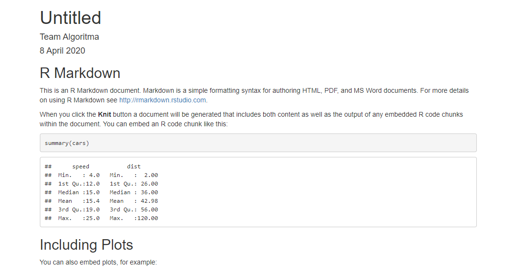

```{r setup, include=FALSE}
# clean up the environment
rm(list = ls())

# setup chunk options
knitr::opts_chunk$set(
  message = FALSE,
  warning = FALSE,
  fig.align = "center",
  comment = "#>"
)

options(scipen = 9999)
```

The following coursebook is produced by the team at **Algoritma** for _Automate: Business Reporting with R_ Online Workshop. The coursebook is intended for a restricted audience only, i.e. the individuals having received this coursebook directly from the training organization. It may not be reproduced, distributed, translated or adapted in any form outside these individuals and organizations without permission.

**Algoritma** is a data science education center based in Jakarta. We organize workshops and training programs to help working professionals and students gain mastery in various data science sub-fields: data visualization, machine learning, data modeling, statistical inference, etc.

Before you go ahead and run the codes in this coursebook, it’s often a good idea to go through some initial setup. Under the **Training Objectives** section we’ll outline the syllabus, identify the key objectives and set up expectations for each module. Under the **Libraries and Setup** section you’ll see some code to initialize our workspace and the libraries we’ll be using for the projects. You may want to make sure that the libraries are installed beforehand by referring back to the packages listed here. 

# Preface {.tabset}

## Introduction

Business reporting has become a common task in many business practices. Business reporting is a regular provision of information about operational or financial data for decision-makers within an organization to support their work. Writing a business report is oftentimes a time-consuming process. It involves the process of gathering data, data analysis, and report preparation which may require us to operate multiple software at once with a very repetitive task. Thus prevent us from focusing on the other more important part of our business.

This 2-day online workshop is a beginner-friendly introduction to automate business reporting with R. By learning how to automate various business reports, you will have more time to focus on what matters the most.

## Training Objectives

This is the very first course of _Automate: Business Reporting with R_. The primary objective of this course is to provide a participant a comprehensive introduction about tools and software for producing a high-quality publication using R and R Markdown. This course will provide participants the basic knowledge for developing Automated Reporting with R. The syllabus covers: 

* **Introduction to R Markdown**
    + R and R Markdown
    + Using R Markdown
    + Writing Codes & Naration
    + Chunk & Global Options
    + Report Template using YAML
    
* **Generate Report from R Markdown**
    + PDF Document
    + Word Document
    + HTML Document
    + Interactive PowerPoint Presentation

* **Parameterized Reports**
    + Declaring parameters
    + Using parameter in code chunks
    + Using parameter inline code

***

## Library and Setup

In this **Library and Setup** section you’ll see some code to initialize our workspace, and the packages we’ll be using for this project. 

_Packages_ are collections of R functions, data, and compiled code in a well-defined format. The directory where packages are stored is called the _library_. R comes with a standard set of packages. Others are available for download and installation. Once installed, they have to be loaded into the session to be used. 

You will need to use `install.packages()` to install any packages that are not yet downloaded onto your machine. To install packages, type the command below on your console then press ENTER.

```{r eval=FALSE}
install.packages("rmarkdown")
```

Then you need to load the package into your workspace using the `library()` function.

```{r eval=FALSE}

```

***

# Introduction to R Markdown

## R and RMarkdown

Business reporting involves a series of gathering data from various resources, performing data analysis, producing summary and visualization, and sometimes even provide a future outlook for a specific business practice within an organization. Numerous software was developed to provide such a rich data analytics process. Throughout the years, _R_ has developed into one of the most used tools for data analysis, supported by _RStudio_ as an Integrated Development Environment (IDE) which provide an easy-to-use user interface in working with R. There are reasons why R is widely used for data analysis:

1. **Built by Statisticians, for Statisticians.**

    R is a statistical programming language created by Ross Ihaka and Robert Gentleman at the Department of Statistics, at the University of Auckland (New Zealand). R is created for the purpose of data analysis and as such, is different in nature from traditional programming languages. [R](https://mran.revolutionanalytics.com/rro) is not just a statistical programming language, it is a complete environment for data analyst and the most widely used data analysis software today.

2. **Plentiful Libraries.**

    R provides numerous additional packages for which add out-of-the-box functionalities for various statistical tests (confidence tests, P-value, t-test, etc), time-series analysis, beautiful visualization, and various machine learning tasks such as regression algorithms, classification algorithms, and clustering algorithms. The R community is noted for its active contributions in terms of packages.

3. **Open Source.** 

    Part of the reason for its active and rapidly growing community is the open-source nature of R. Users can contribute packages – many of which packaged some of the most advanced statistical tools and customized templates for visualization that is not found in other commercials, proprietary statistical computing software.

4. **Used by The Biggest Software Companies in The World.**

    Dive deeper into R's analytical capability, R has been used not only for descriptive analytics but also to develop machine learning and artificial intelligence project of major software companies in the world. R is used by Google to calculate ROI on advertising campaigns and estimate causal effect (say, estimate the impact of an app feature on app downloads or number of additional sales from an AdWords campaign); In fact, it even released its own R packages to allow other R users to do similar analysis using the same [tool](https://opensource.googleblog.com/2014/09/causalimpact-new-open-source-package.html). Data Science employees at Google participate in User Groups to discuss how R is used in Google. It’s used very widely in a production environment at Google and Google integrates R with many of their own technologies, publishing [its own R client for the Google Prediction API](https://code.google.com/archive/p/google-prediction-api-r-client/), [Google’s R style guide](http://web.stanford.edu/class/cs109l/unrestricted/resources/google-style.html), and its developers have released a number of R packages over the years. Microsoft first uses R for Azure capacity planning, Xbox’s TrueSkill Matchmaking System, player churn analysis, in-game purchase optimization, fraud detection, and other internal services across Microsoft’s line of [products](https://blog.revolutionanalytics.com/2015/06/r-at-microsoft.html), and then went on to acquire Revolution Analytics, whom products were then rebranded and renewed by Microsoft and now known as Microsoft R Server, Microsoft R Open, Microsoft Data Science Virtual Machine etc.

5. **Ready for Big Data**

    RHadoop, ParallelR, Revolution R Enterprise and a handful of other toolkits adds powerful big data support, allowing data engineers to create custom parallel and distributed algorithms to handle parallel / map-reduce programming in R. This makes R a popular choice for big data analytics and high performance, enterprise-level analytics platform.

In addition of using R we will be using packages named _R Markdown_. R Markdown is an R packages made for easy development of dynamic documents for R. R Markdown turn our analysis into high quality documents, reports, presentations and dashboards. R Markdown suppports the development of various report and publication using R and open opportunities for **automated reporting**. 

```{r, echo = FALSE, fig.align = "center"}
knitr::include_graphics("assets/hex-rmarkdown.png")
```

R Markdown supports user with **easy analysis** in R because it enables user to weave together narrative text and code in the document. It supports multiple programming language including R, Python and SQL. After performing analysis, R Markdown supports **dozens of static and dynamic output** formats including PDF, Word document, HTML document, and Interactive PowerPoint Presentation. This is made entirely from one R Markdown document, allowing us to **simultaneously export our analysis into various outputs**.

To truly experience the excitement and convinience of using R, our next section will more intersting because we will directly use _R_ and _R Markdown_ to familiarize ourselves with them.

## Using R Markdown

In this first section of the course, we will explain briefly about how to use R Markdwon, from creating an R Markdown document, its component, and how we can produce a report using R Markdown. 

Bofore using R Markdown you need to install the package _rmarkdown_ into your machine. To further learn about packages and installation you can see the **Library and Setup** section above. Make sure that you already have the latest version of [_R_](https://cran.r-project.org/) and [_RStudio_](https://rstudio.com/products/rstudio/download/) installed on your machine. If this is your first time using RStudio, you will see this in your RStudio window:

```{r, out.width = "100%", echo = FALSE, fig.align = "center"}

```

<br>

Above is the default view of RStudio. There are 4 panels each with its function:

* **Editor**: is where we can input codes and naration on specific files which can be saved into our computer.
* **Console**: is where we can input codes and perform analysis without saving it into our computer.
* **Environment**: is where R store our data temporarily when doing data analysis in R. This allow us to see and track our data while doing data analysis. There is also tab **history** and **connection**, though we will not use these in this workshop. 
* **Files, packages, help, etc**: is where we can track our files in our computer, our packages, and search for documentation and description about specific function/command we use in our project. Additionally there are also **plots** and **viewer** to preview plots and files generated using R.

To easily analyze data and produce business report using R we will be using R Markdown. We can create new _R Markdown document_ by clicking on the menu **File > New File > R Markdown**. Alternatively we can hover our mouse to a dropdown menu on the left corner of R Studio   and then choose "R Markdown". We will be directed to a pop-up for creating new R Markdown document.

```{r, out.width = "80%", echo = FALSE, fig.align = "center"}

```

We can choose the **title** and **author** for our project and there are several output options we can choose. For introduction, let's use the default HTML output. An R Markdown document, a plain text file with the extension `.Rmd`, will be created on our Editor panel. 

<br>

```{r, out.width = "100%", echo = FALSE, fig.align = "center"}
knitr::include_graphics("assets/new2.png")
```

<br>

The document contains three types of content:

* **YAML Header** 
    + surrounded by `---` before and after its section. 
    + this is where we can custom our report template (will be discussed in the following section).

* **Code Chunks** 
    + sorrounded by ` ``` ` before and after its section, colored gray.
    + this is where we can put R function/commands for data analysis.
    
* **Text/Naration** 
    + space colored white.
    + this is where we write paragraph or explanation for our business report. 
    + it can be added with various text formatting such as the use of `#` for heading.

These content allow us to write both R command for data analysis and business explanation in one file. That's like working with Excel and Word at the same time, with added functionality to export it into various output with customized template! Such a lot of work can be done with one document. 

In addition to the versatility, another benefit of using R Markdown is its **notebook interface**. With R Markdown, the code inside the chunk can be excecuted independently and interactively, with **output displayed immediately beneath the chunk (inline with our file)**. This allows complex data analysis using R to be performed and previewed easily. For example, if we run the code in the last chunk by clicking the green 'play' icon on the right side, a plot will come out.

```{r, out.width = "100%", echo = FALSE, fig.align = "center"}
knitr::include_graphics("assets/new3.png")
```

Finally, we can also export the document into certain or multiple format by using _Knit_ button  in RStudio on the upper part of the document.

```{r, out.width = "70%", echo = FALSE, fig.align = "center"}

```

If we haven't save our document, R will direct us to save our file. In the example below, the document is saved inside the same _working directory_ (folder) of our workshop material. The best practice is to store our R Markdown document and the data we use in one working directory. This is to prevent any connection error while importing data and such. After knitting the document, R will produce the document output based on the format we choose earlier.

```{r, out.width = "100%", echo = FALSE, fig.align = "center"}
knitr::include_graphics("assets/new6.png")
```

In the next section, we will explore various ways of writing R codes and naration in R Markdown, including simple text formatting that will produce elegantly formatted output.

## Writing Codes & Naration

### Codes

Writing _codes_ in R Markdown can be done inside a _chunk_. In the demo we made earlier, we have 3 chunks with its respective codes. We can quickly insert a chunk into our document using:

* keyboard shortcut Ctrl + Alt + I (OS X: Cmd + Option + I)
* click the add chunk  button in the Editor toolbar.
* manually type chunk delimiters `` ```{r} `` and `` ``` ``.

When we knit our document, the code output will be displayed beneath the code chunk. Below is an example:

```{r}
print("Hello!")
```

Alternatively you can also insert code directly into an R Markdown text or we call it as _inline code_  by enclosing the code with `` `r ` ``. For example, `r paste("did you notice that I write this using R codes?")` Because I did using the codes below.  

````markdown
For example, `r '\x60r paste("did you notice that I write this using R codes?")\x60'`
````

This facilitates user to include data analysis result into his narration in the business report. R Markdown will display the result of an inline code but not the code, making it indistinguishable from the sorrounding text. **This allows flexibility in making an automated business report because we can generate narration adjusting to its changing input and its analysis**.

### Narration

Writing _narration_ in R Markdown is mostly similar to writing narration in any word processing tools. The difference is how R Markdown use [Pandoc's Markdown](https://pandoc.org/MANUAL.html#pandocs-markdown), a set of markup annotations to format the text for our narration.

There are several commonly used annotation in R Markdown. For convinience, we have made a list of it and the preview below. You can access the document `text_formatting.Rmd` in the same folder of couse material. These annotation were taken from [_R Markdown Cheatsheet_](https://rstudio.com/wp-content/uploads/2016/03/rmarkdown-cheatsheet-2.0.pdf) which you can download freely to explore more about various features in R Markdown. 

## Chunk & Global Options

* **Introduction to R Markdown**
    + R and R Markdown  
    + Using R Markdown
    + Writing Codes & Naration
      - codes in chunk, codes in naration
      - naration in chunk, naration in naration
    + Chunk & Global Options
    + Report Template using YAML

## Report Template using YAML


***