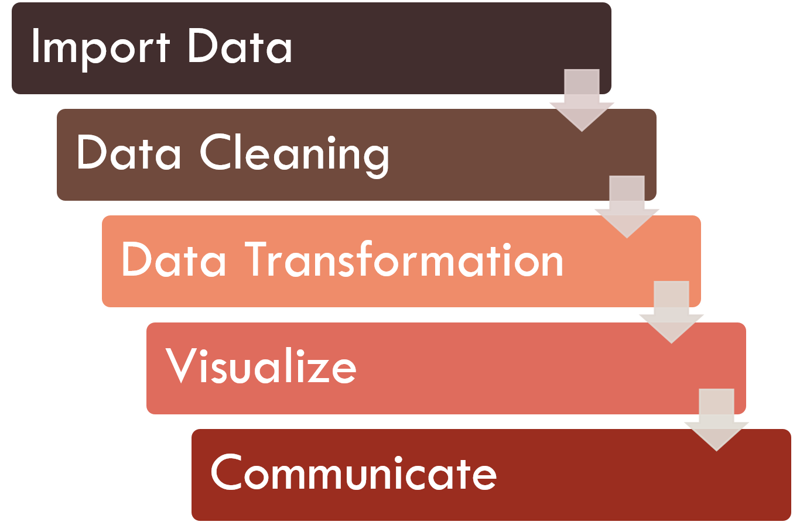

```{r setup, include=FALSE}
# clean up the environment
rm(list = ls())

# setup chunk options
knitr::opts_chunk$set(
  message = FALSE,
  warning = FALSE,
  fig.align = "center",
  comment = "#>"
)

options(scipen = 9999)
```

Before you go ahead and run the codes in this coursebook, it’s often a good idea to go through some initial setup. Under the **Training Objectives** section, we’ll outline the syllabus, identify the key objectives and set up expectations for each module. Under the **Libraries and Setup** section you’ll see some code to initialize our workspace and the libraries we’ll be using for the projects. You may want to make sure that the libraries are installed beforehand by referring back to the packages listed here. 

# Preface {.tabset}

## Introduction

From the previous course, we have learned how R and its extension Rmarkdown can be a versatile tool to generate a high-quality report in various outputs (PDF, Word, HTML Report, Presentation, etc.) Furthermore, Rmarkdown is distinguished for its ability to incorporate the data analytical process from raw data into charts on the document, without ruining its visual. Proper data analysis will certainly result in high-quality content for your business report. Knowing various data analytical processes in R will greatly enhance our ability to use R for automated reporting, using it to its fullest potential.

## Training Objectives

This is the second course of _Automate: Business Reporting with R_. The objective of this course is to provide participants a comprehensive introduction to understand the basic data analysis in R. We will learn techniques on how to transform raw data into a format that is easier to analyze and using descriptive statistics to explain our data. The syllabus covers:

* **Data Science Workflow**
    
* **Basic Programming in R**
    + Object and Environment
    + Data Structures in R
    + Data Type in R

* **Tidying Messy Sheets in R**
    + Importing Dataset
    + Data Cleansing
    + Data Transformation

* **Descriptive Statistics**

* **Automated Reporting of Object in R**

***

## Library and Setup

In this **Library and Setup** section you’ll see some code to initialize our workspace, and the packages we’ll be using for this project. 

_Packages_ are collections of R functions, data, and compiled code in a well-defined format. The directory where packages are stored is called the _library_. R comes with a standard set of packages. Others are available for download and installation. Once installed, they have to be loaded into the session to be used. 

You will need to use `install.packages()` to install any packages that are not yet downloaded onto your machine. To install packages, type the command below on your console then press ENTER.

```{r eval=FALSE}
install.packages("tidyverse")
install.packages("readxl")
```

Then you need to load the package into your workspace using the `library()` function:

```{r eval=FALSE}
library(tidyverse)
library(readxl)
```

***

# Data Science Workflow

Data analysis is highly linked with a buzz-word that many people talk about these days that is Data Science. _Data Science_ is a field that focuses on the study and development of how we can analyze data. It compromises **various acts of data analysis which aims to transform data into valuable insights**.

There is a certain workflow that applies to a data science project. Below is a good chart that explains the **workflow of a data science project**.

```{r, out.width = "80%", echo = FALSE, fig.align = "center"}

```

The first step of a data science work is to _import_ our data into our analytics toolset. There are various analytical tools available, but most of the data science work is usually performed using programming languages. In this workshop, we will be using R.

Once we’ve imported our data, we need to clean our data. _Data cleaning_ means to store our data with the correct labels, values, and structure in the way it should be stored. Data cleaning is important because it helps us focus on our questions about the data, instead of struggling to get our data into the right form for different purposes.

Once we have clean data, the next step is to transform it. _Data transformation_ is the process of converting data or information from one format to another. In data science work, it is usually related to narrowing our observations of interest from the rest of the data. This step is important because it helps us focus on our business questions. 

As an example is to see communities of people in **Jakarta** instead of in **Indonesia**. This is done by creating new data from our dataset by subsetting, summarizing, or adding new variables or information that explain our data. 

Once we have transformed our data, we can perform some exploratory data analysis using **Descriptive Statistics** and _visualize_ them through charts to improve our understanding of the data. We may also build a machine learning model to predict future values.

The last step of data science work is _communication_. It is a critical part of any data analysis project. In this workshop, we will communicate our findings on data through business reports using Rmarkdown.

# Basic Programming in R

The first important step in learning data analysis in _R_ is to recognize how R works, and how it works using _RStudio_- Integrated Development Environment (IDE) for R. First, we should learn about how R and the features in RStudio work.

As an introduction, let’s write our first R code by typing `print("Hello!")` into the _console_ (by default, it is located at the bottom-left of RStudio) and press ENTER. Another preferred method is to run it in the _chunk_ of R Markdown; see the green button that says "Run Current Chunk", or press CTRL + SHIFT + ENTER in the chunk:

```{r}
# this is a nice comment
print("Hello!")
```

```{r}
# print("Hello Algoritma!")
```

`print()` is a _function_ in R. Function is **code that commands** or tells R to do something. In this example, `print()` tells R to "print" the _parameter_ we put inside the bracket, that is `"Hello!"`.

Also, note the `#` character before our code on several lines in the chunks above. These characters will be considered as _comments_, and will not be considered as commands by R. If we run the chunk above, the `print("Hello Algoritma!")` will be ignored by R

## Object and Environment

`"Hello!"` in the previous chunk, was an _object_. Objects can be written raw, like the example above, or can be a _value_ that assigned to an object that has a _name_, using an operator `<-`:

```{r}
activity <- "Programming"

print(activity)
```

After assigning it to an object, we can see a list of the objects we have created in the _Environment Pane_ (by default, located in the upper-right of RStudio). We usually assign our data into an object and further analyze it in R. 

It is also important to note that _R is case-sensitive_; for example, an object "Algoritma" and "algoritma" will be considered different: 

```{r}
# use `==` to compare 2 objects
activity == "Programming"
```

```{r}
activity == "programming"
```

```{r}
# try using object `activity` inside the function `paste()`

paste(activity, "is one of the most therapeutic activities.")
```

```{r}
# there is no object named 'Activity';
# therefore the command below will reveals an error
# print(Activity)
```

Every object that has a name will be unique, so if we create an object with the same name, it will **replace** the old object:

```{r}
activity <- "Coding"

paste(activity, "is one of the most therapeutic activities.")
```

Notice that the word "Programming" has been replaced by "Coding".

## Data Structures in R

The object named `activity` that we have created before is one of the basic forms of data structures in R, namely _vector_. The other data structures that we will study are _matrix_, and _data.frame_.

### Vector

_Vector_ is a 1-dimensional object (meaning that it only has length; not in the form of rows & columns). A vector can be either one of these _types_:

1. character
2. numeric
3. integer
4. logical

A vector can only store values with the **same type**:

```{r}
vector1 <- c("Learning", "Data", "Science", "2019")
vector2 <- c(1, 0, 1)

# we can check the data type using `class()`
class(vector1)
class(vector2)
```

We use the function `c()` or 'concatenate' to **merge** two or more values/objects. We will see a lot of this function throughout our courses.

Every object has attributes. Some common attributes that we usually inspect are **class, length, dim, colnames**, etc. 

We can use `length()` to inspect the length or the total number of values in a vector.

```{r}
length(vector2)
```

We will discuss more about _dim_ and _colnames_ later in this course when we talk about 2-dimensional object.

#### _Character_

A character type vector will often be used to work with **text data**. For example, we have a list of names that we will send an email to:

```{r}
name_vec <- c("Samuel Chan", "Tiara Dwiputri", "Ahmad Husain Abdullah")

name_vec
```

We can use the `paste()` function to make the sentence "Dear XXX,", programmatically:

```{r}
paste("Dear ", name_vec, ",")
```

As we see from the example above, we can process text data by assigning them into character vector. There is also a wide possibility for **advanced data processing techniques** in **text analysis**.

#### _Numeric_

A numeric type vector often used for **numerical data processing**, especially mathematical operations. For example, suppose that we have profit data from the last quarter of our business operations (3 months):

```{r}
profit <- c(150, 87, 95)

profit
```

We can use `mean()` to calculate the average of our profits:

```{r}
mean(profit)
```

R and its extensions have various functions that we can use to perform various kinds of mathematical operations and more complex statistics.

#### _Integer_

An integer type vector is basically the same as the numeric type vector; however, integer type cannot have numbers behind commas or is not a fraction.

```{r}
int_vec <- c(0L, 1L, 4L, 7L, 10L) 

#`L` is used to prevent R read these data as 'numeric' & label them as 'integer' instead.

int_vec
```

Because integers are basically the same as numeric, we can perform mathematical operations using them. 

However, the best practice of using integers is to store **index information** or information that acts as an identifier, such as employee numbers, ID numbers, etc.

#### _Logical_

A logical type vector is better known as boolean terms in general programming languages. This type of vector has 2 kinds of values (TRUE/FALSE; T/F).

This type of vector is usually obtained from other operations, rather than being made by initially. For example, when we have data related to customers that are eligible/not to be given a promo based on their loyalty point:

```{r}
cust_promo <- c(150, 15, 200, 175)
```

If for example, the minimum points required to get a promo is 100 (cust_promo >= 100), we can use function `ifelse()` to classify whether a customer will be given a promo or not:

```{r}
cust_promo2 <- ifelse(test = cust_promo >= 100, 
                      yes = TRUE, no = FALSE)
cust_promo2
```

#### _Other Data Types: Factor & Date_

During data processing in R, we will often use several more advanced data types, namely _factor_ and _date_.

* _Factor_
    
    Factor is a character type vector that has **levels** or categorical values. Each level can appear more than once in a given vector and therefore have **frequency**.
    
```{r}
fctr <- c("Type A", "Type A", "Type B", "Type A", "Type C", "Type C")

fctr <- as.factor(fctr) # converting character-type vector into factor

fctr
```

* _Date_

    Date is a special data type that contains date data in a standardized format.
    
```{r}
purchase_date <- c("2019-01-01", "2019-01-01", "2019-01-02")

purchase_date <- as.Date(purchase_date) # converting character-type vector into date (ymd)

purchase_date
```

### Matrix

_Matrix_ is one way to store **2-dimensional data** in an object. Same as vectors, a matrix can only store objects with the **same type**. To make a matrix, we can use the function `matrix()`:

```{r}
mat <- matrix(11:16, nrow = 3, ncol = 2)
mat
```

Notice how the **value** in a matrix has index `[1, 1]` - can be read as `[row index, column index]`. We can access a certain value from a matrix by its index. 

```{r}
mat[1, ]
```

```{r}
mat[3,1]
```

To see the dimension of a matrix, we can use the `dim()` function and it will return the number of rows and columns in the matrix.

```{r}
dim(mat)
```

We can also retrieve or set the column names of a matrix-like object by using `colnames()`, while for the row names using `rownames()`.

### Data Frame

During our time processing data, we will be frequently faced with data in the form of tables, such as the results of a survey of each employee's activities or the recapitulation of sales from each store branch. **Data in the form of table** is also known as **data.frame**. Similar to matrix, it has 2 dimensions namely _rows_--of observations--and _columns_--of variables, but it can store different data types.

For example, we can create a data.frame using a function `data.frame()`:

```{r}
categories_df <- data.frame(categories = c("OfficeSupplies", "Computers", "Packaging"), category_id = 111:113)

categories_df
```

In this course, we will be focusing more on this data type.

# Tidying Messy Sheets in R

We are now going to learn techniques on how to transform raw data into a format that is easier for analysis. R provides various functions that we can use to process our dataset; from **importing datasets** to **complex aggregations**. These functions are compiled in a _package_. To further learn about packages, you can see **Library and Setup** section.  

Along with the development of R, we can now use several packages that are currently considered as best practices for processing data in R. These packages are included in _tidyverse_ package. Additionally, as most workers use Microsoft Excel to store their data, we will also use _readxl_ package to import an excel spreadsheet into R. 

To load packages into our R session, type:

```{r warning=FALSE, message=FALSE}
library(tidyverse)
library(readxl)
```

## Importing Dataset

R can read data from various formats. For example,  by default R has provided a function to import data in comma-separated value (.csv) format using `read.csv()`. Meanwhile, data stored in other formats may need additional packages and functions for importing. 

In this example, we can use _readxl_ package to import data stored in excel formats (.xlxs, .xls, etc.). We will use "data-attrition.xlsx" (located in `/data` of our working directory) as our data input and assign it to an object named **attrition** (for Sheet 1) and **survey** (for Sheet 2). This data stores employees attrition data and commonly analyzed by the Human Resource Department to know what factors might influence the employee's decisions on leaving the company.

```{r}
attrition <- read_excel(path = "data_input/data-attrition.xlsx",
                             sheet = 1) # sheet index or name

survey <- read_excel(path = "data_input/data-attrition.xlsx",
                          sheet = "survey")
```

By default, the `read_*` function will try to detect the data type of each column. We can use the `head()` to see the first 6 rows of our data to confirm this:

```{r}
head(attrition)
```

```{r}
head(survey)
```

### Relational Data

In various types of businesses, usually have a lot of data tables that must be combined to answer several business questions that are interested in. Multiple data tables are commonly called `relational data` because they have relations, not just one single independent data. Here's an example of relational data looks like:

```{r, out.width = "80%", echo = FALSE, fig.align = "center"}
knitr::include_graphics("assets/data-sales.png")
```

There are two common verbs that are designed to work with relational data: *mutating joins* and *filtering join*. But in this section, we will focus more on examples of mutating joins. Lookups to the [Introduction to Relational Data](https://r4ds.had.co.nz/relational-data.html#introduction-7) for more examples of join data tables.

* *Mutating joins* adds new variables to one data frame from matching observations in another.

A mutating join allows you to combine variables from two tables. It first matches observations by their keys, then copies across variables from one table to the other. Here are some types of mutating join:

1. *inner join*
2. *outer join*
  * `left_join`
  * `right_join`
  * `full_join`
  
Below is an illustration of the different types of joins with a Venn diagram:

```{r, out.width = "100%", echo = FALSE, fig.align = "center"}
knitr::include_graphics("assets/join-venn.png")
```

#### Inner Join

> `inner_join(x, y)`: All rows from x where there are matching values in y, and all columns from x and y.

We are going to use this type of join for our data frame.

```{r}
# joining data frame
data_join <- inner_join(x = attrition, y = survey, by = "employee_number")

head(data_join)
```

```{r eval=FALSE}
# save data_join

write_csv(data_join, path = "data_input/sales_join.csv")
```

#### Left Join

> `left_join(x, y)`: All rows from x and all columns from x and y. Rows in x with no matches in y will have NA values in the joined data frame.

```{r}
# generete data dummy

band <- data.frame(name = c("Mick", "John", "Paul"), 
                   band = c("Stones", "Beatles", "Beatles"))

instrument <- data.frame(name = c("John", "Paul", "Keith"),
                         plays = c("guitar", "bass", "guitar"))

instrument2 <- data.frame(artist = c("John", "Paul", "Keith"),
                          plays = c("guitar", "bass", "guitar"))
```

```{r}
# example left join

left_join(band, instrument, by = "name")
```

#### Right Join

> `right_join(x, y)`: All rows from y and all columns from x and y. Rows in y with no matches in x will have NA values in the joined data frame.

```{r}
# example right join

right_join(band, instrument, by = "name")
```

#### Full Join

> `full_join(x, y)`: All rows and all columns from both x and y. Where there are non-matching values, returns NA.

```{r}
# example full join

full_join(band, instrument, by = "name")
```

### [Opt] Working with Database

In real life, data sources are stored in many different ways. Some might have it in CSV files, some have it in excel, some in a server, some are retrieved from API. Some useful skills you might want to put is how to connect to data sources from R. Most of structured databases is stored using a relational database, and SQL is a common DBMS to use. In this example, I’m going to show you how to connect to a remote Microsoft SQL database. Please do note that connecting to a database require different driver, and we will use ODBC connection. In most cases, R is compatible to connect to major databases with available drivers, such as Microsoft SQL Server, SAP, SPSS.

The driver we want to use can be loaded using _odbc_ and some other SQL-related packages. If you are interested to try, let’s start by installing the packages first:

```{r eval=FALSE}
# install required sql library
install.packages(c("DBI", "odbc", "RMySQL"))
```

Then call them using `library()`:

```{r eval=FALSE}
# import required library
library(DBI)
library(odbc)
library(RMySQL)
```

Once connected, you can make a chunk that runs an SQL query in it that uses the connection object we just made, or just use it in an R session. This is an example of how to make a connection:

```{r eval = FALSE}
# example of connecting through odbc

cn <- DBI::dbConnect(
  odbc::odbc(),
  Driver = "SQL Driver Name", # sql driver name as installed in machine
  Server = "hostname-or-ip-server", # hostname / IP server
  uid = "yourusername", # username
  Database = "yourdatabase", # database
  PWD = rstudioapi::askForPassword("yourpassword"),
  Port = 9999 # your port Number
)
```

## Data Cleansing

After importing our data, we can perform data cleansing. These are some criteria that make up a clean data:

* **Each variable is placed in its own column, each observation in its own row, and each value in its own cell.**

  This is a very important aspect of clean data. This helps us perform various functions and analysis correctly. An example of this is in the [figure](https://garrettgman.github.io/tidying/) below:

```{r, out.width = "80%", echo = FALSE, fig.align = "center"}
knitr::include_graphics("assets/tidy-1.png")
```
Source: Grolemund & Wickham, 2016.

* **Standardized column names**

  R has programming style guides that aim to make R code created by users easier to read, share, and verify. Examples of R programming style guides are [Google's R Style Guide](https://google.github.io/styleguide/Rguide.xml) and the [Tidyverse Style Guide](https://style.tidyverse.org/index.html). Our column names should at least follow this set of style guides. Some examples are naming our columns using **lowercase letter** and separate it with a **dot**(.) or **underscore**(_). 

* **Consistent naming for character-type values** (avoids duplicate data)

* **Numerical values should not contain characters and vice versa**

* **Date-type variables should use either of this format: `ymd` or `ymd-hms`**

Below is an example of 'dirty' data:

```{r echo=FALSE, warning=FALSE, message=FALSE}
bad <- read_csv("data_input/export.csv")
bad %>%
  select(1:9) %>% 
  head(10)
```

This data considered as 'dirty' because:

* the variables were placed in rows instead of columns, 
* the date-type data assigned as column names (this prevent us from utilizing information related to date)
* the numerical value still labeled as characters (chr),
* the numerical value doesn't have consistency in writing/storing their data (spaces used as the separator, decimals are not applied to all values, etc.)

On the contrary, here is an example of a 'clean' data,

```{r echo=FALSE, message=FALSE}
good <- read_csv("data_input/data-export.csv")
good %>% 
  mutate(date = lubridate::dmy(date)) %>% 
  head()
```

The above data is already cleaned by changing its data structure using [_tidyr_](https://tidyr.tidyverse.org/) package. The date information that previously scattered in different columns is now stored in one column `date`. Additionally, the date information also changed into the correct date data type using [_lubridate_](https://lubridate.tidyverse.org/) package. These packages are compiled in tidyverse and were simultaneously loaded into our session when we previously loaded tidyverse. Although we will not use all functions and packages provided in tidyverse, we will discuss the basic concept and practices of data cleaning and transformation in R. This understanding will ease your time in exploring many possibilities of data analysis in R in the long run!

Now, let's look back at our data. We can use the function `glimpse()` from _dplyr_ package to **inspect the structure of our data**.

```{r}
glimpse(data_join)
```

The result above shown that our data consist of 1,470 rows (observations) and 35 columns (variables) whereas each column has different data types. This kind of information is very helpful for us to understand our data. We should also understand the description of each column to evaluate whether that column has the correct data type and whether it has valuable information or not. While most of the column names are self-explanatory, below are additional descriptions for certain columns:

* **attrition**: employee's churn status (yes/no)
* **education**: employee's education level (1 = Below College, 2 = College, 3 = Bachelor, 4 = Master, 5 = Doctor)
* **employee_count**: employee's count for respective id
* **employee_number**: employee's id
* **num_companies_worked**: number of companies worked at
* **stock_option_level**: how many company stocks employees can own from the company

From the above result, we can see that our data is quite tidy for its structure. Each variable is placed in its own column, each observation in its own row, and each value in its own cell. Even so, we can also see that some columns are not stored in the correct data type. Column `education`, maybe better stored as factors for it may not represent a continuous scale but a categorical value. All columns stored as **character** (chr) should also be stored as **factors**.

The _dplyr_ package from tidyverse provides various functions for **data cleaning** such as making/changing columns. Not only that, 'dplyr' also provides **Grammar of Coding** that simplifies our work with codes.

We can change the column data type using the following command and we will breakdown for each steps below.

```{r}
data_join <- data_join %>% 
  mutate(education = as.factor(education)) %>% 
  mutate_if(is.character, as.factor)
```

_Breakdown_

* The first thing we need to do is to understand the _grammar of coding_ using tidyverse. If you see at the end of each command from the chunk above, there is a **pipe operator**  `%>%` that allows users to perform **chaining operations**. In chaining operations, the data on the left side of the `%>%` will be the data used for the next function/command.

* The first function we used above, is `mutate()`. This function is used to transform a column or to create a new column. In this case, we use 'mutate()' to transform 'education', 'job_level', and 'stock_option_level' into factor data type using function `as.factor()`.

* There is also function `mutate_if()` to transform multiple columns with a certain condition, similar to **conditional formatting** in Excel. In this case, if it stores a character data type (is.character) then it will be transformed into factor using `as.factor()`.

Now let's see the first 6 observations of our data to check whether our data is already clean enough.

```{r}
head(data_join)
```

We can see that our attrition data is clean enough and therefore we can continue to the data transformation.

## Data Transformation

_Data transformation_ is a process of converting data from one format or structure into another. Data transformation is a useful tool for _Explanatory Data Analysis (EDA)_ which aims to gain insight and improve our understanding of data by looking at a more detailed or narrower perspective, based on our business question. The package _dplyr_ also provides various functions for data transformation such as making/changing columns, subsetting columns/rows, and summarizing data.

To put it into practice, let's try performing data transformation to our data. Imagine ourselves as an HR staff who wants to evaluate the employee's attrition status of your company. We would like to know:

> Which department gives the highest number of employee attrition? 

The following are complete codes that command R to perform the data transformation. We will breakdown each step and explain it in detail.

```{r}
data_join %>%
  group_by(attrition, department) %>%
  summarise(count = n()) %>%
  ungroup() %>% 
  filter(attrition == "yes") %>% 
  select(-attrition) %>% 
  arrange(desc(count))
```

_Breakdown_

* In the example above, the first thing we do is creating a summarise of our data using `group_by()`, `summarise()`, and `ungroup()`. The function `group_by` will take existing data (columns) and converts it into a 'grouped table' where **operations are performed 'by group'**. The function `summarise()` will perform a **summary statistic calculation**, in this case, count by using `n()` on the 'grouped table' from the previous chaining operation. The function `ungroup()` remove the grouping condition. These functions are quite similar to the **pivot table** in Excel. 

```{r}
data_join %>%
  group_by(attrition, department) %>%
  summarise(count = n()) %>%
  ungroup()
```

* The next function is `filter()`.  We can use this function to subset our row data based on specific conditions. In this case, we filter (only take) every observation or rows from column attrition which have 'yes' as it values. 

```{r}
data_join %>%
  group_by(attrition, department) %>%
  summarise(count = n()) %>%
  ungroup() %>% 
  filter(attrition == "yes")
```

* Next we can use `select()` to remove the column attrition from our data.

```{r}
data_join %>%
  group_by(attrition, department) %>%
  summarise(count = n()) %>%
  ungroup() %>% 
  filter(attrition == "yes") %>% 
  select(-attrition)
```

* The final step is to sort our data using `arrange()`. To sort it descending, we can use the helper function `desc()`:

```{r}
data_join %>%
  group_by(attrition, department) %>%
  summarise(count = n()) %>%
  ungroup() %>% 
  filter(attrition == "yes") %>% 
  select(-attrition) %>% 
  arrange(desc(count))
```

From the result above, we know that the department which gives the highest number of employees attrition is from Research and Development. This department may need further analysis regarding its employee's attrition.

The above example shows how we can summarise our full data into a simplified version which only displays the number of leaving employees (attrition = "yes") per department. Others might prefer to display both staying and leaving employees from all departments but with a more compressed structure. For example, we will use some of the code we made earlier but without filtering.

```{r eval=FALSE}
data_join %>%
  group_by(attrition, department) %>%
  summarise(count = n()) %>%
  ungroup()
```

Instead, we will transform our data into its wider format using function `pivot_wider()` from _tidyr_ package. This function will separate the values from column 'attrition' into 2 different columns and filling it with values from column 'count'. 

```{r}
data_pivot <- data_join %>%
  group_by(attrition, department) %>%
  summarise(count = n()) %>%
  ungroup() %>% 
  pivot_wider(names_from = attrition, values_from = count)

data_pivot
```

Alternatively, we can transform data from its wide into its long format using `pivot_longer()`:

```{r}
data_pivot %>% 
  pivot_longer(cols = c(no, yes), # columns to be joined
               names_to = "attrition", # name of new column
               values_to = "count") # name of new column (value) 
```

There are many more functions and technical details that we can explore further from tidyverse. If you are interested, you can visit the following articles:

* [Data Wars: Episode IV - A New Hope in Data Manipulation using R](https://algotech.netlify.com/blog/data-wars-episode-iv/)
* [Data Wrangling with dplyr](https://altruimetavasi.shinyapps.io/DW_dplyr/)

_**Dive Deeper**_

The grammar of code from 'dplyr' is very powerful for Exploratory Data Analysis (EDA). Using attrition data, try to answer the following questions to sharpen your intuition on data analysis using R:

1. From the Research and Development department, which job role gives the highest number of employee attrition and what is their average relationship satisfaction? What insight can we take from the result?

```{r}
# your code here:

```

2. Is there gender inequality in your company? Calculate the percentage of the female and male employees from each department! 

```{r}
# your code here:

```

You can also create your own question and try to answer it to sharpen your analytical skills!

***